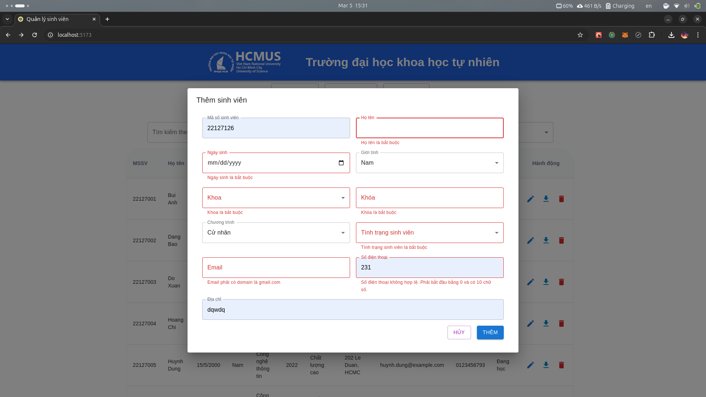

# Student Management Web Application - Version 3.0

This is a lightweight web application built with NestJS, Prisma, React, and SQLite for managing a list of students. Version 3.0 introduces stricter validation rules and configurable constraints to ensure data consistency and improve business logic enforcement.

## New Features in Version 3.0

### 1. MSSV Uniqueness

- **Requirement:**  
  The student MSSV must be unique.
- **Implementation:**  
  When creating or updating a student, the system checks if the provided MSSV already exists. If so, it rejects the request.

### 2. Configurable Email Domain Validation

- **Requirement:**  
  The student's email must belong to a specified domain (e.g., `@student.university.edu.vn`).
- **Implementation:**  
  The allowed email domain is configurable via environment variables.

### 3. Configurable Phone Number Validation

- **Requirement:**  
  Phone numbers must be valid for the country (e.g., Vietnam).
- **Implementation:**  
  A regular expression validates the phone number in both local and international formats (e.g., `0[3|5|7|8|9]xxxxxxxx` or `+84[3|5|7|8|9]xxxxxxxx`).

### 4. Student Status Transition Rules

- **Requirement:**  
  The student's status can only change following certain rules:
  - If the current status is `"Đang học"`, it may change only to `"Bảo lưu"`, `"Tốt nghiệp"`, or `"Đình chỉ"`.
  - If the current status is `"Đã tốt nghiệp"`, it cannot revert to `"Đang học"`.
- **Implementation:**  
  The update service enforces these rules when processing status updates.

## Additional Enhancements

- **Improved Data Import/Export:**
  - Supports importing data from both Excel and CSV formats.
  - Handles Excel serial dates (e.g., `37165.29201388889`) by converting them to proper DateTime values.
  - Ensures Unicode text (e.g., Vietnamese characters) is correctly decoded.
- **Prisma & NestJS Integration:**  
  Uses Prisma as the ORM with SQLite as the database and leverages NestJS's modular architecture for improved maintainability and testability.
- **Dynamic Configuration:**  
  Environment variables (via the ConfigModule) allow dynamic configuration of allowed email domain and other validation parameters.
- **Validation & Error Handling:**  
  DTOs enforce strict validation rules for MSSV, email, and phone number formats.
- **Global Validation:**  
  The global `ValidationPipe` ensures that all incoming requests conform to the defined DTOs before reaching the controllers.

## Screenshots





## Source Code Structure

```plaintext
student-management/
├── public/             # Static assets (app icon)
├── src/
│   ├── components/     # UI components
│   ├── hooks/          # Custom hooks
│   ├── App.tsx         # Main application component
│   ├── main.tsx        # Application entry point
│   ├── types.d.ts      # Data types
│   ├── vite-env.d.ts   # Vite environment variables
├── backend/
│   ├── prisma/         # Prisma schema and client
│   ├── logs/           # Log files
│   ├── src/
│   │   ├── student     # Student controller and service
│   │   ├── faculty     # Faculty controller and service
│   │   ├── program     # Program controller and service
│   │   ├── status      # Student status controller and service
│   │   ├── main.ts     # Main server file
│   ├── .env            # Environment variables
│   ├── .env.example    # Example environment variables
│   ├── .gitignore      # Git ignore file
│   ├── package.json    # Project metadata and dependencies
│   ├── tsconfig.json   # TypeScript configuration
│   ├── sample/         # Sample data file
├── screenshots/        # Screenshots of the application
├── docs/               # Documentation files
├── eslint.config.js    # ESLint configuration operations
├── index.html          # Main HTML file
├── package.json        # Project metadata and dependencies
├── tsconfig.app.json   # TypeScript configuration for the frontend
├── tsconfig.node.json  # TypeScript configuration for the backend
├── tsconfig.json       # TypeScript configuration
├── version.json        # Version and build date information
└── vite.config.ts      # Vite configuration
```

## Requirements

- **Node.js** (v20)
- **pnpm** (Node package manager)

## Installation

1. Clone the repository and navigate to the project directory:

```bash
git clone
cd student-management
```

2. Install dependencies using pnpm:

```bash
pnpm install
```

3. Install backend dependencies:

```bash
cd backend
pnpm install
```

## Running the Application

### Frontend

Start the Vite development server:

```bash
pnpm dev
```

Access the app at `http://localhost:5173`

### Backend

Add a `.env` file in the `backend/` folder with the following content:

```plaintext
ALLOWED_EMAIL_DOMAIN=your.email.domain
```

Run Prisma migrations and seed initial data:

```bash
cd backend
pnpm dlx prisma migrate dev --name init
pnpm seed
```

Start the Node.js backend server:

```bash
pnpm start
```

This will start the Node.js backend to manage database operations.\

## Testing

### Backend Tests:

Run unit and integration tests with:

```bash
cd backend
pnpm test
```

## Building for Production

To build the application for production, run:

```bash
pnpm build
```

The compiled files will be available in the `dist/` directory. This command also generates a `version.json` file containing the version and build date information.

## Data Import/Export

- Export Excel: Click the "Export Excel" button on the main screen to download student data as an Excel file.

- Import Excel: Use the "Import Excel" button to import student data from an Excel file.

- Import Sample Data: Click the "Thêm dữ liệu mẫu" button to import sample data from the file sample/sample.xlsx.

## Version Information

The application automatically generates a version.json file during the build process (using the version number from package.json) and displays the current version and build date in the footer.

## Logging

All backend operations are logged using Winston. The log files are stored in the logs/ folder for troubleshooting and audit purposes.

## Usage Notes

- **MSSV Uniqueness:**
  Attempting to add or update a student with an existing MSSV will result in an error.

- **Email Validation:**:
  WOnly emails ending with the configured domain (default: @student.university.edu.vn) are accepted.

- **Phone Number Validation:**
  Phone numbers must match the configured Vietnamese format.

- **Student Status Rules:**
  The student status must follow the specified transition rules.

- **Global Validation:**
  All incoming data is validated by a global validation pipe before being processed.
