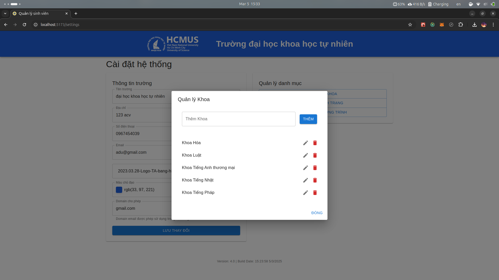

# Student Management Web Application - Version 3.0

This is a lightweight web application built with TypeScript, React, and SQLite for managing a list of students. Version 3.0 introduces significant enhancements over the previous version, including advanced category management, extended search capabilities, sample data import, logging mechanisms, and version display.

## New Features in Version 3.0

- **Category Management:**
  - **Rename and Add New Categories:** Manage Faculty, Student Status, and Program via a dedicated modal.
  - **Automatic Update:** When a category is renamed, all related student records update automatically via triggers to ensure data consistency.
- **Extended Search:**
  - Filter students by Faculty and search by MSSV or Name.
- **Data Import/Export Enhancements:**
  - **Excel Import/Export:** Improved handling for dates and phone numbers, with proper formatting (dates displayed as dd/mm/yyyy and phone numbers retaining leading zeros).
  - **Sample Data Import:** Easily import sample student data from a provided sample file (`sample/sample.xlsx`) by clicking a dedicated button.
- **Logging Mechanism:**
  - Integrated logging using Winston for troubleshooting production issues and audit purposes. All logs are stored in the `logs/` folder.
- **Version and Build Date Display:**
  - The application footer displays the current version and build date (auto-generated during build).
- **Validation and Error Handling:**
  - Enhanced validation and error handling for form inputs, with detailed error messages displayed to the user.

## Screenshots





## Source Code Structure

```plaintext
student-management/
├── public/             # Static assets (app icon)
├── src/
│   ├── components/     # UI components
│   ├── hooks/          # Custom hooks
│   ├── App.tsx         # Main application component
│   ├── main.tsx        # Application entry point
│   ├── types.d.ts      # Data types
│   ├── vite-env.d.ts   # Vite environment variables
├──
├── backend/            # Backend Node.js server
│   ├── prisma/         # Prisma schema and client
│   ├── logs/           # Log files
│   ├── src/
│   │   ├── student     # Student controller and service
│   │   ├── faculty     # Faculty controller and service
│   │   ├── program     # Program controller and service
│   │   ├── status      # Student status controller and service
│   │   ├── main.ts    # Main server file
│   ├── .env            # Environment variables
│   ├── .env.example    # Example environment variables
│   ├── .gitignore      # Git ignore file
│   ├── package.json    # Project metadata and dependencies
│   ├── tsconfig.json   # TypeScript configuration
│   ├── sample/         # Sample data file
├── screenshots/        # Screenshots of the application
├── eslint.config.js    # ESLint configuration
 operations
│   index.html          # Main HTML file
├── package.json        # Project metadata and dependencies
├── tsconfig.app.json   # TypeScript configuration for the frontend
├── tsconfig.node.json  # TypeScript configuration for the backend
├── tsconfig.json       # TypeScript configuration
├── version.json        # Version and build date information
└── vite.config.ts      # Vite configuration
```

## Requirements

- **Node.js** (v20)
- **pnpm** (Node package manager)

## Installation

1. Extract the source code to a folder and navigate to the project directory:
   ```bash
   cd student-management
   ```
2. Install dependencies using pnpm:
   ```bash
   pnpm install
   ```
3. Install backend dependencies:
   ```bash
   cd backend
   pnpm install
   ```

## Running the Application

### Frontend

Start the Vite development server:

```bash
pnpm dev
```

Access the app at `http://localhost:5173`

### Backend (SQLite Server)

Start the Node.js backend server:

```bash
cd backend
pnpm start
```

This will start the Node.js backend to manage database operations.

## Building for Production

To build the application for production, run:

```bash
pnpm build
```

The compiled files will be available in the `dist/` directory. This command also generates a `version.json` file containing the version and build date information.

## Data Import/Export

- Export Excel: Click the "Export Excel" button on the main screen to download student data as an Excel file.

- Import Excel: Use the "Import Excel" button to import student data from an Excel file.

- Import Sample Data: Click the "Thêm dữ liệu mẫu" button to import sample data from the file sample/sample.xlsx.

## Version Information

The application automatically generates a version.json file during the build process (using the version number from package.json) and displays the current version and build date in the footer.

## Logging

All backend operations are logged using Winston. The log files are stored in the logs/ folder for troubleshooting and audit purposes.

## Usage Notes

- **Database**:
  The SQLite database file (db.sqlite) is automatically created in the db/ folder if it does not already exist.

- **Category Updates**:
  When a category (Faculty, Student Status, or Program) is updated, related student records are automatically updated.

- **Date and Phone Formatting**:
  Student date of birth is returned in the dd/mm/yyyy format, and phone numbers retain any leading zeros.
