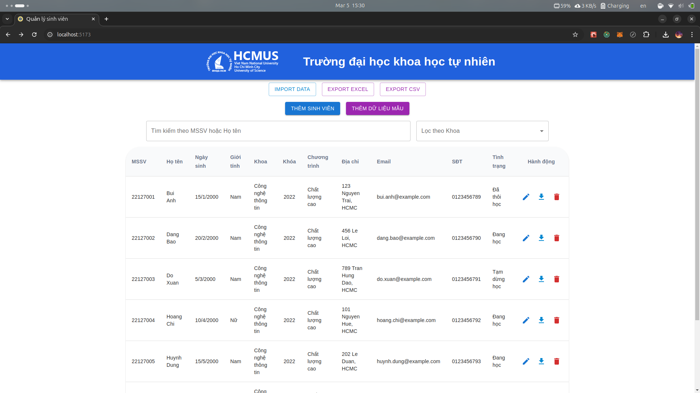

# Student Management Web Application - Version 4.0

This is a lightweight web application built with NestJS, Prisma, React, and PostgreSQL for managing a list of students. Version 4.0 introduces stricter validation rules and configurable constraints to ensure data consistency and improve business logic enforcement.

## New Features in Version 4.0

### 1. Cloud Image Storage with Cloudinary

- **Requirement:**  
  Store school logo images in the cloud to ensure availability and scalability.
- **Implementation:**  
  Utilize Cloudinary for image storage and management, featuring:
  - Direct image upload to Cloudinary
  - Automatic image optimization
  - Secure and globally accessible URLs

### 2. School Configuration Management

- **Dynamic School Settings:**
  - Manage school information (name, address, logo, colors)
  - Configure allowed email domains
  - Customize interface based on configuration

### 3. Student Verification PDF/MD Generation

- **Feature:**
  - Generate official student verification documents
  - Customizable templates with school branding
  - Support for multiple verification purposes
  - Digital format for easy sharing and printing

### 4. Student Deletion with Time Constraint

- **Feature:**
  - Delete students with a configurable time constraint
  - Prevent deletion of students who have been added recently

### 5. School Logo and Name Display

- **Feature:**
  - Display school logo and name in the application
  - Customize the display based on configuration

## Additional Enhancements

### 1. PostgreSQL Database

- **Feature:**
  - Use PostgreSQL as the database
  - Implement Prisma ORM for database operations
  - Provide sample data for testing

### 2. Banner Color Customization

- **Feature:**
  - Customize the banner color based on configuration

## Screenshots




## Source Code Structure

```plaintext
student-management/
├── public/             # Static assets (app icon)
├── src/
│   ├── components/     # UI components
│   ├── hooks/          # Custom hooks
│   ├── pages/          # Pages
│   ├── services/       # RTK Query services
│   ├── app/            # Redux Toolkit store, provider, and hooks
│   ├── features/       # Feature modules
│   ├── middleware/     # Middleware
│   ├── App.tsx         # Main application component
│   ├── main.tsx        # Application entry point
│   ├── types.d.ts      # Data types
│   ├── vite-env.d.ts   # Vite environment variables
├── backend/
│   ├── prisma/         # Prisma schema and client
│   ├── logs/           # Log files
│   ├── src/
│   │   ├── student     # Student controller and service
│   │   ├── faculty     # Faculty controller and service
│   │   ├── program     # Program controller and service
│   │   ├── status      # Student status controller and service
│   │   ├── config      # School configuration controller and service
│   │   ├── upload      # Upload controller and service
│   │   ├── data        # Data controller and service
│   │   ├── logger      # Logger controller and service
│   │   ├── main.ts     # Main server file
│   ├── .env            # Environment variables
│   ├── .env.example    # Example environment variables
│   ├── .gitignore      # Git ignore file
│   ├── package.json    # Project metadata and dependencies
│   ├── tsconfig.json   # TypeScript configuration
│   ├── sample/         # Sample data file
├── screenshots/        # Screenshots of the application
├── docs/               # Documentation files
├── eslint.config.js    # ESLint configuration operations
├── index.html          # Main HTML file
├── package.json        # Project metadata and dependencies
├── tsconfig.app.json   # TypeScript configuration for the frontend
├── tsconfig.node.json  # TypeScript configuration for the backend
├── tsconfig.json       # TypeScript configuration
├── version.json        # Version and build date information
└── vite.config.ts      # Vite configuration
```

## Requirements

- **Node.js** (v20)
- **pnpm** (Node package manager)

## Installation

1. Clone the repository and navigate to the project directory:

```bash
git clone
cd student-management
```

2. Install dependencies using pnpm:

```bash
pnpm install
```

3. Install backend dependencies:

```bash
cd backend
pnpm install
```

## Running the Application

### Frontend

Start the Vite development server:

```bash
pnpm dev
```

Access the app at `http://localhost:5173`

### Backend

Add a `.env` file in the `backend/` folder with the following content:

```plaintext
DATABASE_URL=your_postgresql_database_url
CLOUDINARY_CLOUD_NAME=your_cloud_name
CLOUDINARY_API_KEY=your_api_key
CLOUDINARY_API_SECRET=your_api_secret
```

Run Prisma migrations and seed initial data:

```bash
cd backend
pnpm dlx prisma migrate dev --name init
pnpm seed
```

Start the Node.js backend server:

```bash
pnpm start
```

This will start the Node.js backend to manage database operations.\

## Testing

### Backend Tests:

Run unit and integration tests with:

```bash
cd backend
pnpm test
```

## Building for Production

To build the application for production, run:

```bash
pnpm build
```

The compiled files will be available in the `dist/` directory. This command also generates a `version.json` file containing the version and build date information.

## Data Import/Export

- Export Excel: Click the "Export Excel" button on the main screen to download student data as an Excel file.

- Import Excel: Use the "Import Excel" button to import student data from an Excel file.

- Import Sample Data: Click the "Thêm dữ liệu mẫu" button to import sample data from the file sample/sample.xlsx.

## Version Information

The application automatically generates a version.json file during the build process (using the version number from package.json) and displays the current version and build date in the footer.

## Logging

All backend operations are logged using Winston. The log files are stored in the logs/ folder for troubleshooting and audit purposes.

## Usage Notes

- **MSSV Uniqueness:**
  Attempting to add or update a student with an existing MSSV will result in an error.

- **Email Validation:**:
  WOnly emails ending with the configured domain (default: @student.university.edu.vn) are accepted.

- **Phone Number Validation:**
  Phone numbers must match the configured Vietnamese format.

- **Student Status Rules:**
  The student status must follow the specified transition rules.

- **Global Validation:**
  All incoming data is validated by a global validation pipe before being processed.

## Environment Configuration

Add the following environment variables to your `.env` file:

```plaintext
DATABASE_URL=your_postgresql_database_url
CLOUDINARY_CLOUD_NAME=your_cloud_name
CLOUDINARY_API_KEY=your_api_key
CLOUDINARY_API_SECRET=your_api_secret
```

## File Upload Guidelines

### Supported Image Formats

- JPG/JPEG
- PNG
- GIF

### Size Limits

- Maximum file size: 5MB
- Recommended dimensions for logo: 200x200px

### Security

- Automatic file type validation
- Secure URL generation
- Cloud storage with backup
